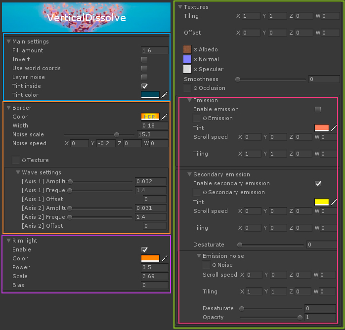

# VerticalDissolve      

This shader allows you to dissolve objects in a vertical fashion, and provides several parameters to create unique transitions.

It can be edited through [Amplify Shader Editor](http://amplify.pt/unity/amplify-shader-editor) and contributions to the project are always welcome!

---

Project developed using **Unity 2017.4.8f1**. Please use this version if you are planning on contributing. You can work on your own branch and send a pull request with your changes.

---

_(Beware: The media folder is quite heavy at the moment, I need to find a way to reduce file size for gifs without losing too much quality)_

You can also just download a **unitypackage** (lightweight) from the [releases tab](https://github.com/AdultLink/VerticalDissolve/releases) and easily import everything to your project. This will not download the _screenshots_ folder.

_Disclaimer: The scripts controlling the behavior of the examples provided are not optimized in any way and should only be taken as quick & dirty examples._

Third-party (free) assets used in this project:
- [FREE Skybox - Cubemap extended, by BOXOPHOBIC](https://assetstore.unity.com/packages/vfx/shaders/free-skybox-cubemap-extended-107400)
- [Strong knight, by 3DMAESEN](https://assetstore.unity.com/packages/vfx/shaders/free-skybox-cubemap-extended-107400)
- [Charmander model, by ClassyGoat](https://www.thingiverse.com/thing:826836)
- [Snorlax model, by Anthonylu](https://www.thingiverse.com/thing:1780291)

# Table of contents
1. [Getting started](#getting-started)
2. [Usage & parameters](#usage-parameters)
   - 2.1 [Main settings](#main-settings)
   - 2.2 [Border](#border)
   - 2.3 [Rim light](#rim-light)
   - 2.4 [Textures](#textures)
      - 2.4.1 [Emission](#emission)
3. [Examples](#examples)
4. [Donate](#donate)
5. [License](#license)

# Getting started
Setup is minimal, all you need to do is create a new material that uses the shader and assign it to your meshRenderer, then just play around with settings.

# Usage, parameters

This shader is comprised of a few "modules", that work independently and can be activated/deactivated without affecting each other.

## Main settings

- `Fill amount`: Pretty self-explanatory, this is what makes it a vertical dissolve shader!
- `Invert`: Inverts the opacity mask, effectively reversing the dissolve direction as well.
- `Use world coordinates`: Use world coordinates instead of vertex coordinates, might be useful in some cases.
- `Tint inside`: Allows you to tint the interior faces of the mesh with `Tint color`.

## Border

Border/edge settings. This refers to the dissolve edge defined by `Fill amount`. Main parameters are `Width` and `Color`. To make this edge a little bit more interesting, you can add some noise and waviness to it.

- `Noise scale`: How big you want that noise to be? _Note: Noise will only be noticeable when wave amplitude is != 0 in at least one axis._
- `Noise speed`: Make that noise move!
- `Layer noise`: Use a second layer of noise for a more unique appearance.
- `Texture`: Additionally, you could have a texture instead of a simple color as edge.
- `Wave settings`: Think of it as a sine wave whose inputs you can control. Two perpendicular axes.

Go crazy on the wave & noise settings for unique results!

## Rim light

Although the dissolve effect is the main goal of this shader, it also provides the possibility of adding a rim light to your models, since it seems reasonable these two effects would be used together.

Adjust `Color`, `Power`, `Scale` and `Bias` to your liking.

## Textures

Standard texture maps can be assigned here, as you would normally on your standard (specular) unity shader.

### Emission

In regards to emission, there are a couple caveats. You can still apply your emission map as usual, by ticking `Enable emission`, but you can also make it scroll by setting a `Scroll speed`.

Similarly to the case of rim light, it seemed reasonable to add a little bit more functionality in this area. That's why it is possible to add a second emission map that you can also scroll. This second emission map will be ADDED to the first one.

Furthermore, a third texture (noise) can be assigned as a way of modulating the second one.

Lastly, both secondary emission and the emission noise can be desaturated, so that you have a bit more control over the final color. For instance, you could use a non-grayscale texture as noise by setting the `Desaturate` slider to 1. _Note: desaturation is applied before coloring_-

So, in short: _Final emission = emission + secondaryEmission * emissionNoise._

An instance of this can be seen on the "lava orb" example:

# Examples

# Donate 

This piece of software is offered for free because I believe the gamedev community can benefit from it, and it should not be behind a paywall. I learned from the community, and now I am giving back.

If you would like to support me, donations are very much appreciated, since they help me create more software that I can offer for free.

Thank you very much :)

# License
MIT License

Copyright (c) 2018 Guillermo Angel

Permission is hereby granted, free of charge, to any person obtaining a copy
of this software and associated documentation files (the "Software"), to deal
in the Software without restriction, including without limitation the rights
to use, copy, modify, merge, publish, distribute, sublicense, and/or sell
copies of the Software, and to permit persons to whom the Software is
furnished to do so, subject to the following conditions:

The above copyright notice and this permission notice shall be included in all
copies or substantial portions of the Software.

THE SOFTWARE IS PROVIDED "AS IS", WITHOUT WARRANTY OF ANY KIND, EXPRESS OR
IMPLIED, INCLUDING BUT NOT LIMITED TO THE WARRANTIES OF MERCHANTABILITY,
FITNESS FOR A PARTICULAR PURPOSE AND NONINFRINGEMENT. IN NO EVENT SHALL THE
AUTHORS OR COPYRIGHT HOLDERS BE LIABLE FOR ANY CLAIM, DAMAGES OR OTHER
LIABILITY, WHETHER IN AN ACTION OF CONTRACT, TORT OR OTHERWISE, ARISING FROM,
OUT OF OR IN CONNECTION WITH THE SOFTWARE OR THE USE OR OTHER DEALINGS IN THE
SOFTWARE.

